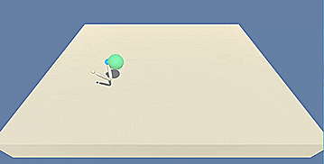
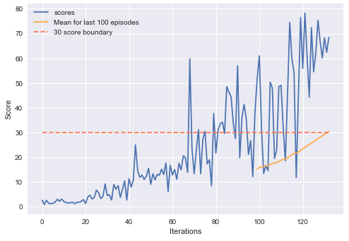

# DDPG arm reacher
Showcase of DDPG implementation in PyTorch



An agent will learn how to follow the orbitin green sphere.

## Environment
Agent is given a vector of 33 observations about corresponding to position, rotation, velocity, and angular velocities of the arm.

Each action is a vector with four numbers, corresponding to torque applicable to two joints. Every entry in the action vector should be a number between -1 and 1.

Actor gets a reward of +0.1 for each timestep it spends in the goal location.

## Algorithm
Agent's brain was a Deep Deterministic Policy Gradient, an Actor-Critic class Reinforcement Learning algorithm, implemented according to https://arxiv.org/abs/1509.02971 with Ornstein-Uhlenbeck random process.

## Results
Agent was able to solve the environment in 32 episodes (mean window starting at 32nd episode exceeded solution threshold)



## Installation
#### Pre-requisites
Packages:
- Pytorch
- Numpy
- UnityAgents

Additionaly, Jupyter notebook (or Jupyter lab) for displaying solution

#### Process
You need to manually download environment binaries for your system:
- [Linux](https://s3-us-west-1.amazonaws.com/udacity-drlnd/P2/Reacher/one_agent/Reacher_Linux.zip)
- [MacOSX](https://s3-us-west-1.amazonaws.com/udacity-drlnd/P2/Reacher/one_agent/Reacher.app.zip)
- [Windows (32-bit)](https://s3-us-west-1.amazonaws.com/udacity-drlnd/P2/Reacher/one_agent/Reacher_Windows_x86.zip)
- [Windows (64-bit)](https://s3-us-west-1.amazonaws.com/udacity-drlnd/P2/Reacher/one_agent/Reacher_Windows_x86_64.zip)
  
After downloading, unpack all files and place them in directory `data/`. Then, swap string in cell 4 
```
env = UnityEnvironment(file_name = "data/Banana.exe")
```
with one proper to your OS. Notebook using pytorch implementation is in location `pytorch/Navigation_pytorch.ipynb`, and tensorflow in `tensorflow/Navigation.ipynb`.